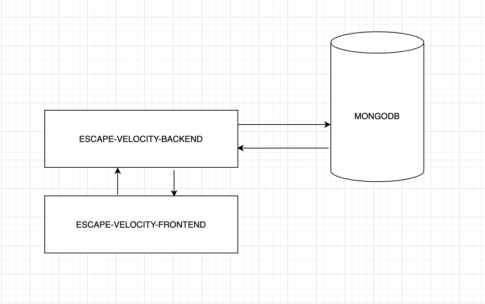

Привет братан!

Теперь наша хата остоит из микросервисов:

Что нужно знать:

- запускать с помощью bin/start.sh (в первый раз занимает долго, потом быстро)
- Фронтенд живет на localhost:3000, бэкенд на localhost:5000, монго на localhost:27017
- Когда вносишь изменения в код, нужно просто обновить браузер (потом может сделаю live reload). Исключение: установка
новых dependencies. Они пока требуют перезапуска системы
- CTRL + C чтобы остановить систему

Но можешь работать и по старинке, это как тебе удобней! АУФ!

